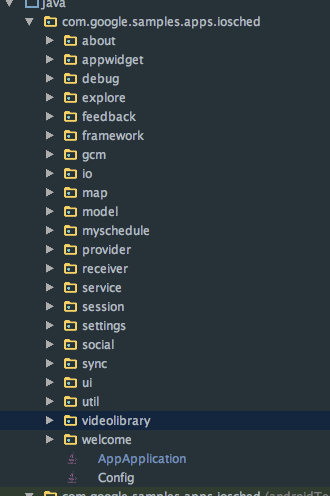
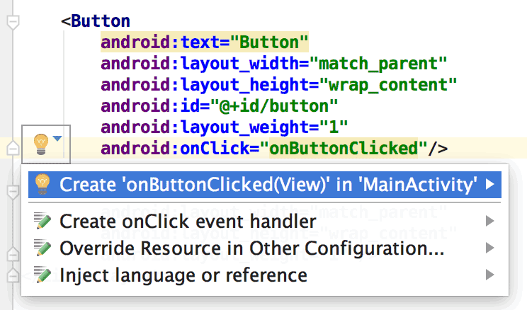

最近做项目做的越来越烦人了，可以说近一年以来基本上没什么长进，反而有所退步。以往的激情已经被业务磨灭，真的真的该重新做点什么了。人无近虑，必有远忧。一直逃不开自己的舒适区，让自己在放纵，另一方面也是担忧自己当下的技能能否适应新的环境，总而言之，真的该认真学习好好看书了。否则的话，自己会被淘汰的。

## 一、代码目录结构
本项目是一个比较传统的目录结构(其实还是有一些向MVP方向发展了)，即根据功能点进行分包，如下所示:




### 1、我的日程

界面组成元素：TabLayout + ViewPager + ListFragment
#### 1.1、在Activity中的内部类
标准的使用流程如下，通过弱引用的方式持有Activity，防止由于内部类持有外部类导致的内存泄露

``` 
/**
 * If in conference day, redraw the day's UI every @{link #INTERVAL_TO_REDRAW_UI} ms, so
 * that time sensitive widgets, like "now", "ended" and appropriate styles are updated.
 *
 * @param today the index in the conference days array that corresponds to the current day.
 */
private void setTimerToUpdateUI(final int today) {
    new UpdateUIRunnable(this, today, new Handler()).scheduleNextRun();
}

boolean hasBeenDestroyed() {
    return mDestroyed;
}

static final class UpdateUIRunnable implements Runnable {

    final WeakReference<MyScheduleActivity> weakRefToParent;
    final Handler handler;
    final int today;

    public UpdateUIRunnable(MyScheduleActivity activity, int today, Handler handler) {
        weakRefToParent = new WeakReference<MyScheduleActivity>(activity);
        this.handler = handler;
        this.today = today;
    }

    public void scheduleNextRun() {
        handler.postDelayed(this, INTERVAL_TO_REDRAW_UI);
    }

    @Override
    public void run() {
        MyScheduleActivity activity = weakRefToParent.get();
        if (activity == null || activity.hasBeenDestroyed()) {
            LOGD(TAG, "Ativity is not valid anymore. Stopping UI Updater");
            return;
        }
        LOGD(TAG, "Running MySchedule UI updater (now=" +
                new Date(UIUtils.getCurrentTime(activity)) + ")");
        if (activity.mScheduleAdapters != null
                && activity.mScheduleAdapters.length > today
                && activity.mScheduleAdapters[today] != null) {
            try {
                activity.mScheduleAdapters[today].forceUpdate();
            } finally {
                // schedule again
                this.scheduleNextRun();
            }
        }
    }
}
```


#### 1.2、在XML文件中利用tools属性

可能我们已经习惯了在编写代码的时候设置一个默认的android:text="这是一个XXX"之类的文本用于预览，但实际上我们可以通过tools:text="这才是正确的使用方式"，当然硬编码的方式也是错误的。首先附上[官方教程](https://developer.android.com/studio/write/tool-attributes.html)，官网永远是我们学习的最佳来源。

``` 
<RootTag xmlns:android="http://schemas.android.com/apk/res/android"
    xmlns:tools="http://schemas.android.com/tools" >

<TextView
    android:id="@+id/slot_description"
    android:layout_width="match_parent"
    android:layout_height="wrap_content"
    android:layout_marginTop="4dp"
    android:layout_marginEnd="8dp"
    android:layout_marginRight="8dp"
    android:textSize="@dimen/text_size_medium"
    tools:text="9:00 AM - 11:30 AM / Room 1"
    style="@style/Body1Text" />
    </RootTag>
```    
##### 1.2.1、tools:ignore
在任何元素中使用，主要是用于lint检查的时候忽略，例如：

```
<string name="show_all_apps" tools:ignore="MissingTranslation>All</string>
```
##### 1.2.2、tools:targetApi
在任何元素中使用，主要是用于lint检查的时候忽略，此属性和java中的注释代码[@TargetAPi](https://developer.android.com/reference/android/annotation/TargetApi.html)类似，通过这个属性你能指定元素所能运行的API版本，例如下面这个，指定了这个GridLayout只能用于API版本14以上的版本：

```
<GridLayout xlmns:android="http://schemas.android.com/apk/res/android"
  xlmns:tools="http://schemas.android.com/tools"
  tools:targetApi="14">
```
##### 1.2.3、tools:locale
在任何元素中使用，主要是用于lint检查的时候忽略，此属性和java中的注释代码[@TargetAPi](https://developer.android.com/reference/android/annotation/TargetApi.html)类似，通过这个属性你能指定元素所能运行的API版本，例如下面这个，指定了这个GridLayout只能用于API版本14以上的版本：

```
<GridLayout xlmns:android="http://schemas.android.com/apk/res/android"
  xlmns:tools="http://schemas.android.com/tools"
  tools:targetApi="14">
```

##### 1.2.4、tools:instead of android
在View中使用，主要是用于Android Studio layout editor，如本节开始所示。

##### 1.2.5、tools:context
在xml文件的跟布局中使用，主要是用于Android Studio layout editor，可以指定该xml文件预览时的主题以及类似于onClick属性使用QuickFix快捷生成对应方法所在的Activity。



```
<android.support.constraint.ConstraintLayout
	xmlns:android="http://schemas.android.com/apk/res/android"
	xmlns:tools="http://schemas.android.com/tools"
	tools:context=".MainAcivity"/>
```
##### 1.2.6、tools:layout
在xml文件的跟布局中使用，主要是用于Android Studio layout editor，可以指定该Fragment预览时候的布局。


```
<fragment android:name="com.example.master.ItemListFragment"
    tools:layout="@layout/list_content" />

```
##### 1.2.7、还有更多需要去学习

#### 1.3、处理Fragment中的生命周期
大家都知道，在Fragment使用过程中，有时候会出现getActivity()=null的情况，这时候就会导致NullPointException(**注意：如需 Fragment 内的某个 Context 对象，可以调用 getActivity()。但要注意，请仅在片段附加到 Activity 时调用 getActivity()。如果片段尚未附加，或在其生命周期结束期间分离，则 getActivity() 将返回 null**)。因此，我们可以在onAttach()的时候传入Activity，如下所示：

```    @Override
    public void onAttach(Activity activity) {
        super.onAttach(activity);
        LOGD(TAG, "Attaching to activity");
        mActivity = activity;
    }

    @Override
    public void onDetach() {
        super.onDetach();
        mActivity = null;
    }
```
高版本API

```    @Override
    public void onAttach(Context context) {
        super.onAttach(context);
        LOGD(TAG, "Attaching to activity");
        mActivity = (Activity)context;
    }

    @Override
    public void onDetach() {
        super.onDetach();
        mActivity = null;
    }
```

### 2、探索
#### 2.1、
### 3、地图
### 4、社交
### 5、视频
### 6、设置
#### 6.1、使用PreferenceFragment
### 7、关于
#### 7.1、加载HTML资源
	···Html.fromHtml(getString(<![CDATA[
        <b>Google I/O 2015</b><br>
        Version %s
    ]]>,"xxx"))```
 
#### 7.2
### 8、调试
#### 8.1、使用PreferenceFragment

